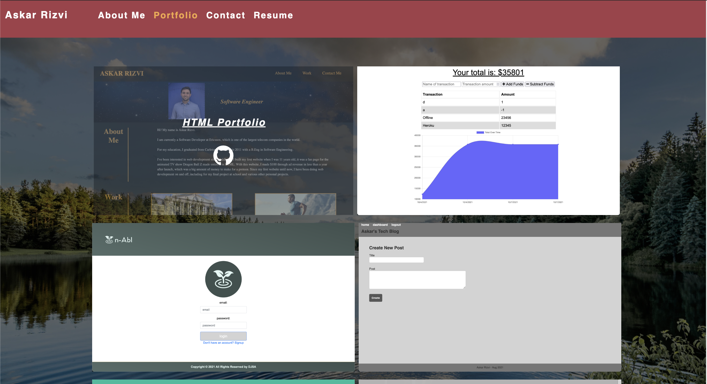

# Askar's Portfolio in React

  

  ## Description
  The challenge for this week involves building a portfolio website rendered by React. There are several components that need to
  be rendered in this challenge, including the Header, the Navigation, the Projects and the Footer in addition to the main pages. The About page will show a picture of myself and a short bio. The Portfolio page will render the Projects component that
  will show six of the Projects I have completed during the bootcamp. The Contact page will have a form to fill out with a
  message to contact me. The Resume page will have a link to my resume, as well as show a list of some of my technical
  proficiencies from the bootcamp.

  ## Table of Contents

* [Installation](#installation)
* [Usage](#usage)
* [License](#license)
* [Deployment](#deployment)
* [Questions](#questions)

## Installation
1: Clone the repository from Github 2:  Run NPM Install to install the modules 3:  Run "npm start" to start the server 4:  Access the website at http://localhost:3001/ or https://askarrizvi.github.io/askars-react-portfolio/ 

## Usage

## License
https://opensource.org/licenses/MPL-2.0  
Licensed under Mozilla Public License 2.0

## Deployment
https://askarrizvi.github.io/askars-react-portfolio/

## Questions
https://github.com/askarrizvi  
